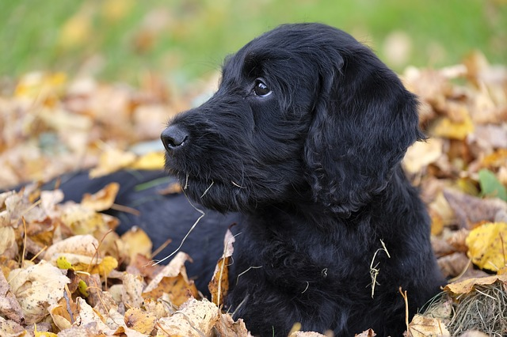

# labradoodle-detector
Train your computer to detect adorable labradoodles!

This code walks you gently through the process of taking an existing modern image classifier and re-purposing it as a labradoodle detector.  We'll show you just how far you can go with even a very small dataset.  No specialised hardware required - you can follow along entirely on your (Intel)-optimized CPU.

## Installing prerequisites
Docker image? Or compare TF-for-IA?

pip install -r requirements.txt
